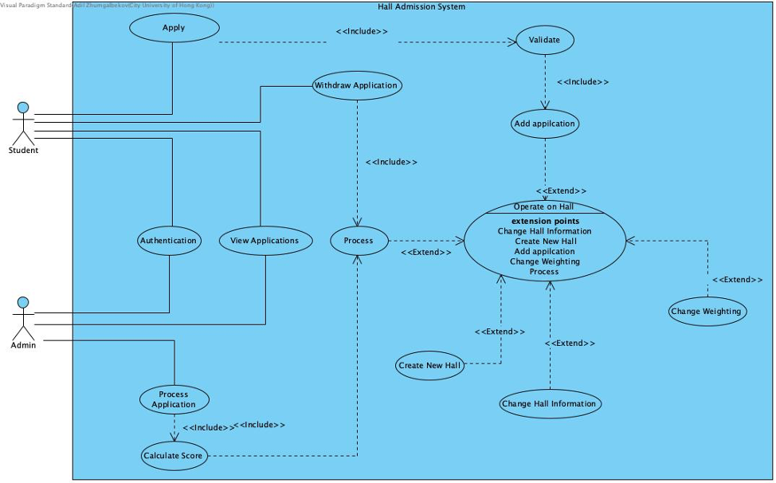
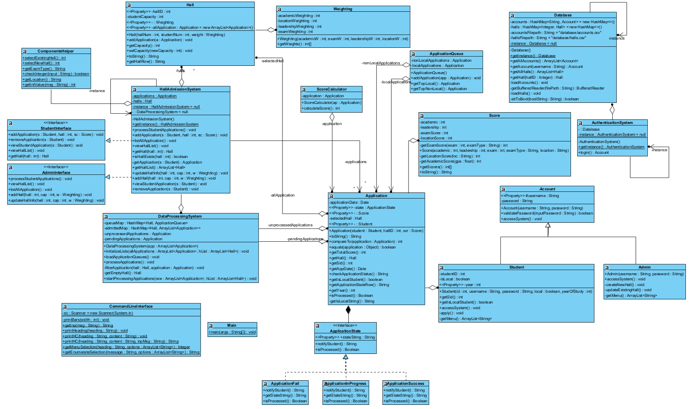

# Hall_Admission_System

Hall Admission System is designed as a solution to handle the hall admission procedure for both the student and the university. It is an admission platform that accepts student applications to halls and automatically admits applications based on predefined rules and hall requirements. This system allows students to browse available halls and submit admission to their desired hall. Students can also check the status of their application to see if it is successful. The staff can update the information on existing halls and add new halls when needed. The staff can also view all applications in the hall and process all the applications automatically with the built-in application processing algorithm.

## User Diagram 

**User Requirement**			 		
Users must log in using their username and password through a dedicated login portal to access the Hall Admission System. All accounts are stored in a CSV file named "accounts.csv," When the login portal is initialized, the system reads from this file. Users will get a welcome message and a list of functionalities after successful login.

## Class Diagram

**Design Principles and Patterns**	 		
Open-Closed Principle  		
Interface-Segregation Principle  		
Law of Demeter  		
 		

